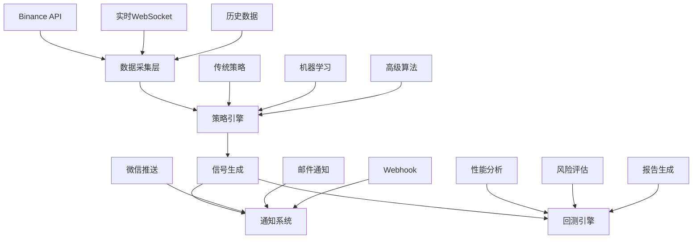

<div align="center">

# 🤖 AI Stock Trading System

### 智能量化交易系统 - 基于人工智能的股票交易解决方案

[](https://www.typescriptlang.org/)
[](https://nodejs.org/)
[](https://opensource.org/licenses/MIT)
[](https://github.com/onmyway0011/AI-Stock/stargazers)


---

**🚀 [快速开始](#-快速开始) • 📊 [功能特性](#-功能特性) • 📈 [回测系统](#-回测系统) • 🔔 [信号推送](#-信号推送系统) • 📚 [文档](#-文档)**

---

</div>

## 🌟 项目简介

AI Stock Trading System 是一个基于 TypeScript 开发的专业级量化交易系统，集成了数据采集、策略开发、回测分析、信号生成和消息推送等完整功能模块。系统采用模块化架构设计，支持多种交易策略和机器学习算法。

<table>
<tr>
<td>

### ✨ 核心亮点
- 🧠 **智能信号生成** - 80%置信度阈值保证信号质量
- 📱 **微信实时推送** - 即时获取交易信号通知
- 📊 **全面回测系统** - 2年历史数据验证策略效果
- 🔄 **自动化测试** - 智能检测和修复代码问题
- 🛡️ **风险控制** - 多维度风险评估和管理

</td>
<td>

### 🎯 技术特色
- **TypeScript** - 类型安全的现代化开发
- **模块化架构** - 高度可扩展的系统设计
- **机器学习** - 集成随机森林和LSTM模型
- **实时数据** - WebSocket实时市场数据流
- **云原生** - Docker容器化部署支持

</td>
</tr>
</table>

---

## 🚀 快速开始

### 📦 安装与配置

```bash
# 克隆项目
git clone git@github.com:onmyway0011/AI-Stock.git
cd AI-Stock

# 安装依赖
npm install

# 环境配置
cp .env.example .env
# 编辑 .env 文件，配置API密钥和微信服务号信息
```

### ⚡ 快速体验

```bash
# 🎮 交易信号系统演示（含微信推送）
npm run demo:signals

# 📊 历史回测演示
npm run demo:backtest

# 📈 策略开发演示
npm run demo:advanced

# 🔍 数据收集演示
npm run demo:data
```

---

## 📊 功能特性

<div align="center">

### 🏗️ 系统架构图



</div>

### 🔧 核心模块

<table>
<tr>
<td width="50%">

#### 📈 **策略引擎**
- 🎯 **传统技术分析** - MA, RSI, MACD, 布林带
- 🧠 **机器学习策略** - 随机森林, LSTM神经网络
- 🏗️ **高级策略** - 左侧建仓, 网格交易, 动态参数
- 🔄 **策略优化** - 遗传算法, 网格搜索
- 🛡️ **风险控制** - 仓位管理, 止损止盈

#### 🔔 **信号推送系统**
- 📱 **微信服务号** - 模板消息实时推送
- 📧 **多渠道通知** - 邮件, 短信, Webhook
- ⏰ **智能过滤** - 静默时间, 优先级控制
- 📊 **推送统计** - 成功率监控, 失败重试

</td>
<td width="50%">

#### 📊 **数据采集系统**
- 🔄 **实时数据流** - Binance WebSocket 多品种
- 📚 **历史数据** - 5年历史K线数据缓存
- 💾 **智能存储** - SQLite/MongoDB 多格式支持
- 🚀 **高效缓存** - Redis 缓存机制
- 🔍 **数据验证** - 完整性检查和清洗

#### 📈 **回测分析系统**
- 🕒 **历史回测** - 最长5年历史数据验证
- 📊 **性能指标** - 30+ 专业量化指标
- 📑 **报告生成** - HTML/Markdown/JSON多格式
- 🎯 **参数优化** - 自动寻找最优参数组合
- 📈 **可视化图表** - 资金曲线, 回撤分析

</td>
</tr>
</table>

---

## 🔔 信号推送系统

### 🎯 核心特性

<table>
<tr>
<td>

#### 📱 **微信服务号推送**
```typescript
// 80%置信度阈值控制
signalService.setConfidenceThreshold(0.8);

// 智能信号过滤
const signal = await signalService.analyzeMarket(marketData);
if (signal && signal.confidence.overall >= 0.8) {
    await signalService.sendSignalNotification(signal);
}
```

</td>
<td>

#### ⚙️ **推送消息示例**
```
🔔 买入信号提醒

📊 交易品种: BTCUSDT
💪 信号强度: 强
🎯 置信度: 85.2%
💰 建议价格: 45000.0000
⛔ 止损价格: 44100.0000
🎁 止盈价格: 46800.0000
⚠️ 风险等级: MEDIUM

📝 分析: RSI超卖,MACD金叉
⏰ 时间: 01-15 20:44
```

</td>
</tr>
</table>

### 🛠️ 推送配置

```typescript
const notificationConfig = {
  enabled: true,
  quietHours: { start: '23:00', end: '07:00' },    // 静默时间
  maxDailyNotifications: 50,                       // 每日限制
  channels: [NotificationChannel.WECHAT],          // 推送渠道
  filters: {
    minConfidence: 0.8,                           // 最小置信度
    priorityOnly: false                           // 是否只推送高优先级
  }
};
```

---

## 📈 回测系统

### 🎮 快速回测

```bash
# 基础回测 - 移动平均策略
npm run backtest

# 指定参数回测
npm run backtest -- --strategy ma --symbol ETHUSDT --years 2

# 参数优化回测
npm run backtest -- --strategy leftside --optimize --metric sharpeRatio

# 策略对比回测
npm run backtest compare --symbols BTCUSDT,ETHUSDT --years 1.5
```

### 📊 性能指标 (30+ 专业指标)

<table>
<tr>
<td>

#### 💰 **收益指标**
- 📈 总收益率 / 年化收益率
- 📊 累计收益 / 基准对比
- 🎯 Alpha / Beta 系数
- 📉 收益波动率

</td>
<td>

#### 🛡️ **风险指标**
- 📉 最大回撤 / 回撤持续时间
- 🎲 VaR (95% / 99%)
- 📊 下行标准差 / 偏度峰度
- 🔄 波动率 (日/年化)

</td>
<td>

#### ⚖️ **风险调整收益**
- 🏆 夏普比率 / 索提诺比率
- 📈 卡玛比率 / 信息比率
- 🎯 特雷诺比率 / Calmar比率
- 📊 收益回撤比

</td>
</tr>
</table>

### 📈 示例回测结果

<details>
<summary><b>📊 移动平均策略 - BTCUSDT (2年回测)</b></summary>

```
╔══════════════════════════════════════════════════════════════════╗
║                        回测结果报告                             ║
╠══════════════════════════════════════════════════════════════════╣
║ 📈 总收益率        │ +24.67%     ║ 📊 年化收益率    │ +11.56%   ║
║ 🏆 夏普比率        │ 1.34        ║ 📉 最大回撤      │ -8.45%    ║
║ 🎯 胜率           │ 58.3%       ║ 🔄 交易次数      │ 156       ║
║ 💰 盈亏比          │ 1.67        ║ ⚖️ 索提诺比率    │ 1.89      ║
╚══════════════════════════════════════════════════════════════════╝
```

</details>

<details>
<summary><b>🧠 左侧建仓策略 - ETHUSDT (1.5年优化回测)</b></summary>

```
╔══════════════════════════════════════════════════════════════════╗
║                      优化回测结果                               ║
╠══════════════════════════════════════════════════════════════════╣
║ 🎯 最优夏普比率     │ 1.78        ║ 📈 总收益率      │ +31.45%   ║
║ 📊 年化收益率       │ +19.23%     ║ 📉 最大回撤      │ -12.34%   ║
║ 🎲 胜率           │ 52.1%       ║ 🔄 交易次数      │ 89        ║
║ ⚙️ 最优参数        │ minDrop: 4% │ maxBuilding: 5次 │           ║
╚══════════════════════════════════════════════════════════════════╝
```

</details>

---

## 🧪 测试系统

### 🔄 自动化测试修复

```bash
# 智能检测并自动修复问题
npx ts-node scripts/auto-test-fix.ts

# 运行完整测试套件  
npm test

# 生成覆盖率报告
npm test -- --coverage
```

### 📊 测试覆盖率


- ✅ **工具函数测试** - 数学计算、日期处理、数据验证
- ✅ **信号系统测试** - 信号生成、通知管理、服务控制  
- ✅ **回测引擎测试** - 策略执行、性能计算、报告生成
- ✅ **自动修复系统** - 编译错误、测试失败智能修复

---

## 🛠️ 开发指南

### 🏗️ 项目结构

```
src/
├── 📊 backtest/           # 回测系统
│   ├── engine/            # 回测引擎核心
│   ├── reports/           # 报告生成器
│   └── runners/           # 回测运行器
├── 🧠 strategies/         # 交易策略
│   ├── base/              # 基础策略框架
│   ├── traditional/       # 传统技术分析
│   ├── advanced/          # 高级交易策略
│   ├── ml/                # 机器学习策略
│   └── optimization/      # 参数优化
├── 🔔 signals/            # 信号生成系统
│   ├── generators/        # 信号生成器
│   └── SignalService.ts   # 信号服务
├── 📱 notifications/      # 通知推送系统
│   ├── channels/          # 通知渠道
│   └── NotificationManager.ts
├── 📈 data/               # 数据系统
│   ├── collectors/        # 数据收集器
│   ├── processors/        # 数据处理器
│   └── storage/           # 数据存储
└── 🛠️ utils/             # 工具函数
```

### 🎯 创建自定义策略

```typescript
import { BaseStrategy } from './src/strategies/base/BaseStrategy';
import { Signal, MarketData } from './src/types';

export class MyCustomStrategy extends BaseStrategy {
  async generateSignal(marketData: MarketData): Promise<Signal | null> {
    // 实现您的交易逻辑
    const { closes, volumes } = this.extractData(marketData);
    
    if (this.detectBuySignal(closes, volumes)) {
      return this.createBuySignal(marketData);
    }
    
    return null;
  }
  
  private detectBuySignal(closes: number[], volumes: number[]): boolean {
    // 自定义买入条件
    const sma20 = this.calculateSMA(closes, 20);
    const sma50 = this.calculateSMA(closes, 50);
    
    return sma20[sma20.length - 1] > sma50[sma50.length - 1];
  }
}
```

---

## 🐳 部署方案

### 📦 Docker 容器化

```bash
# 构建镜像
npm run docker:build

# 运行容器
npm run docker:run

# 开发环境
npm run docker:compose
```

### ☁️ 云平台部署

<table>
<tr>
<td>

#### 🚀 **推荐配置**
- **CPU**: 2核心以上
- **内存**: 4GB 以上  
- **存储**: 20GB SSD
- **网络**: 稳定的网络连接

</td>
<td>

#### 🔧 **环境要求**
- **Node.js**: 18.0.0+
- **npm**: 8.0.0+
- **TypeScript**: 5.1.6+
- **Redis**: 6.0+ (可选)

</td>
</tr>
</table>

---

## 📚 文档

<table>
<tr>
<td>

### 📖 **使用指南**
- [🚀 快速开始指南](./docs/quick-start.md)
- [📊 回测系统详解](./docs/backtest-guide.md)
- [🔔 信号推送配置](./docs/signal-system-guide.md)
- [📈 数据收集指南](./docs/data-collection-guide.md)

</td>
<td>

### 🔧 **开发文档**
- [🏗️ 架构设计文档](./docs/architecture.md)
- [🎯 策略开发指南](./docs/strategy-development.md)
- [🔌 API 参考文档](./docs/api-reference.md)
- [🧪 测试报告](./TEST_REPORT.md)

</td>
</tr>
</table>

---

## 🤝 贡献指南

我们欢迎所有形式的贡献！请查看 [贡献指南](CONTRIBUTING.md) 了解详情。

### 🛠️ 开发工作流

```bash
# 1. Fork 项目并克隆
git clone git@github.com:yourusername/AI-Stock.git

# 2. 创建功能分支
git checkout -b feature/amazing-feature

# 3. 提交更改
git commit -m "✨ Add amazing feature"

# 4. 推送分支
git push origin feature/amazing-feature

# 5. 创建 Pull Request
```

### 🏆 贡献者

感谢所有为这个项目做出贡献的开发者！

---

## 📄 许可证

本项目基于 [MIT 许可证](LICENSE) 开源。

---

## ⚠️ 风险提示

<div align="center">

> ⚠️ **重要提醒**
> 
> 本系统仅供**学习研究**使用，不构成投资建议。
> 
> 历史回测结果**不代表未来收益**，投资需谨慎。
> 
> 请在充分理解风险的前提下使用本系统。

</div>

---
## 📞 联系我们

<div align="center">

[](https://github.com/onmyway0011/AI-Stock)
[](https://github.com/onmyway0011/AI-Stock/issues)
[](https://github.com/onmyway0011/AI-Stock/discussions)

**如果这个项目对您有帮助，请给我们一个 ⭐ Star！**

</div>

---

<div align="center">

**Made with ❤️ by the AI Stock Trading Team**

*让智能化交易触手可及*

</div>