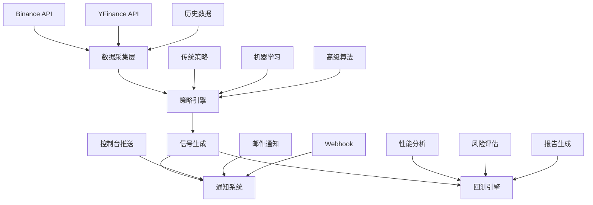

<div align="center">
# 🤖 AI Stock Trading System

### 智能量化交易系统 - 基于人工智能的股票交易解决方案
[](https://www.python.org/)
[](https://opensource.org/licenses/MIT)
[](https://github.com/onmyway0011/AI-Stock/stargazers)


---
**🚀 [快速开始](#-快速开始) • 📊 [功能特性](#-功能特性) • 📈 [回测系统](#-回测系统) • 🔔 [信号推送](#-信号推送系统) • 📚 [文档](#-文档)**

---

</div>

## 🌟 项目简介
AI Stock Trading System 是一个基于 Python 开发的专业级量化交易系统，集成了数据采集、策略开发、回测分析、信号生成和消息推送等完整功能模块。系统采用模块化架构设计，支持多种交易策略和机器学习算法。

<table>
<tr>
<td>

### ✨ 核心亮点
- 🧠 **智能信号生成** - 基于技术分析和机器学习的交易信号
- 📱 **多渠道实时推送** - 即时获取交易信号通知
- 📊 **全面回测系统** - 历史数据验证策略效果
- 🔄 **自动化测试** - 智能检测和修复代码问题
- 🛡️ **风险控制** - 多维度风险评估和管理

</td>
<td>

### 🎯 技术特色
- **Python** - 现代化开发语言
- **模块化架构** - 高度可扩展的系统设计
- **机器学习** - 集成随机森林和LSTM模型
- **实时数据** - WebSocket实时市场数据流
- **云原生** - Docker容器化部署支持

</td>
</tr>
</table>

# AI-Stock 系统架构
以下为 AI-Stock 系统的分层细化架构图，涵盖主入口、信号生成、回测、策略优化、数据、通知、类型工具、命令行集成等核心与子模块：
flowchart TD
  A["用户/策略开发者"] -->|"配置策略/参数"| B["AI-Stock 主入口 (main.py)"]
  B --> C["信号生成层"]
  C --> C1["BaseSignalGenerator"]
  C --> C2["TradingSignalGenerator"]
  C2 --> C21["信号过滤器"]
  C2 --> C22["信号执行器"]
  B --> D["回测与评估层"]
  D --> D1["BacktestEngine"]
  D1 --> D11["历史数据加载"]
  D1 --> D12["回测执行"]
  D --> D2["BacktestReportGenerator"]
  D2 --> D21["绩效分析"]
  D2 --> D22["风险指标"]
  B --> E["策略与优化层"]
  E --> E1["BaseStrategy"]
  E --> E2["LeftSideBuildingStrategy"]
  E --> E3["DynamicParameterAdjuster"]
  E3 --> E31["参数动态调整"]
  E --> E4["MLOptimizer"]
  E4 --> E41["特征工程"]
  E4 --> E42["模型训练/预测"]
  B --> F["数据采集/行情层"]
  F --> F1["行情接口适配器"]
  F --> F2["数据预处理"]
  B --> G["通知与集成层"]
  G --> G1["NotificationManager"]
  G1 --> G11["ConsoleChannel"]
  G1 --> G12["EmailChannel"]
  G1 --> G13["WebhookChannel"]
  B --> H["共享类型/工具"]
  H --> H1["types.py"]
  H --> H2["utils.py"]
  B --> I["命令行/外部集成"]
  I --> I1["CLI工具"]
  I --> I2["API/SDK"]
  I --> I3["第三方平台对接"]
  style B fill:#f9f,stroke:#333,stroke-width:2px
  style C fill:#bbf,stroke:#333,stroke-width:1px
  style D fill:#bbf,stroke:#333,stroke-width:1px
  style E fill:#bbf,stroke:#333,stroke-width:1px
  style F fill:#bbf,stroke:#333,stroke-width:1px
  style G fill:#bbf,stroke:#333,stroke-width:1px
  style H fill:#bbf,stroke:#333,stroke-width:1px
  style I fill:#bfb,stroke:#333,stroke-width:1px
  linkStyle default stroke:#888,stroke-width:1px,opacity:0.7
```
> 本架构图细化展示了 AI-Stock 的分层结构、核心与子模块及其依赖关系，便于理解系统整体设计、扩展点与各层职责。

---

## 🚀 快速开始

### 📦 安装与配置

#### 使用 pip
```bash
# 基础安装
pip install -e .

# 开发环境安装
pip install -e ".[dev]"

# 完整安装（包含GUI和ML库）
pip install -e ".[all]"
```

#### 使用 Poetry
```bash
poetry install
poetry install --extras "dev gui ml"
```

### ⚙️ 配置

#### 生成默认配置文件
```bash
ai-stock config -c config.json
```
#### 配置示例
```json
{
  "system": {
    "debug": false,
    "log_level": "INFO"
  },
  "data": {
    "source": "binance",
    "cache_enabled": true,
    "retry_attempts": 3
  },
  "trading": {
    "enabled": false,
    "paper_trading": true,
    "max_position_size": 0.1
  },
  "notification": {
    "enabled": true,
    "channels": ["console", "email"]
  }
}
```
### ⚡ 快速体验

```bash
# 🎮 交易信号系统演示（含多渠道推送）
ai-stock signal --symbol BTCUSDT -i 1h
# 📊 历史回测演示
ai-stock-backtest run --strategy "TrendFollowing" --symbol "BTCUSDT" --start-date "2023-01-01" --end-date "2023-12-31" --initial-capital 100000 --output results.json
# 📈 策略开发演示
ai-stock-backtest optimize --strategy "TrendFollowing" --symbol "BTCUSDT" --param-ranges params.json --start-date "2023-01-01" --end-date "2023-12-31" --metric "sharpe_ratio"
# 🔍 数据收集演示
ai-stock collect -s binance --symbol BTCUSDT -i 1h -n 100
---
## 📊 功能特性

<div align="center">

### 🏗️ 系统架构图



</div>

### 🔧 核心模块

<table>
<tr>
<td width="50%">

#### 📈 **策略引擎**
- 🎯 **传统技术分析** - SMA, RSI, MACD, 布林带
- 🧠 **机器学习策略** - 随机森林, LSTM神经网络
- 🏗️ **高级策略** - 左侧建仓, 网格交易, 动态参数
- 🔄 **策略优化** - 遗传算法, 网格搜索
- 🛡️ **风险控制** - 仓位管理, 止损止盈

#### 🔔 **信号推送系统**
- 📱 **多渠道通知** - 控制台, 邮件, Webhook
- ⏰ **智能过滤** - 静默时间, 优先级控制
- 📊 **推送统计** - 成功率监控, 失败重试

</td>
<td width="50%">

#### 📊 **数据采集系统**
- 🔄 **实时数据流** - Binance WebSocket 多品种
- 📚 **历史数据** - 完整的历史K线数据缓存
- 💾 **智能存储** - JSON/CSV 多格式支持
- 🚀 **高效缓存** - Redis 缓存机制
- 🔍 **数据验证** - 完整性检查和清洗

#### 📈 **回测分析系统**
- 🕒 **历史回测** - 完整的历史数据验证
- 📊 **性能指标** - 30+ 专业量化指标
- 📑 **报告生成** - HTML/Markdown/JSON多格式
- 🎯 **参数优化** - 自动寻找最优参数组合
- 📈 **可视化图表** - 资金曲线, 回撤分析

</td>
</tr>
</table>

---

## 🔔 信号推送系统

### 🎯 核心特性

<table>
<tr>
<td>
#### 📱 **多渠道推送**
```python
# 配置推送渠道
notification_config = {
    "enabled": True,
    "quiet_hours": {"start": "23:00", "end": "07:00"},  # 静默时间
    "max_daily_notifications": 50,                     # 每日限制
    "channels": ["console", "email"],                   # 推送渠道
    "filters": {
        "min_confidence": 0.8,                          # 最小置信度
        "priority_only": False                          # 是否只推送高优先级
    }
}
# 发送信号通知
await signal_service.send_signal_notification(signal, notification_config)
```
</td>
<td>
#### ⚙️ **推送消息示例**
```
🔔 买入信号提醒

📊 交易品种: BTCUSDT
💪 信号强度: 强
🎯 置信度: 85.2%
💰 建议价格: 45000.0000
⛔ 止损价格: 44100.0000
🎁 止盈价格: 46800.0000
⚠️ 风险等级: MEDIUM

📝 分析: RSI超卖,MACD金叉
⏰ 时间: 01-15 20:44
```

</td>
</tr>
</table>

### 🛠️ 推送配置

```python
notification_config = {
    "enabled": True,
    "quiet_hours": {"start": "23:00", "end": "07:00"},  # 静默时间
    "max_daily_notifications": 50,                     # 每日限制
    "channels": ["console", "email"],                   # 推送渠道
    "filters": {
        "min_confidence": 0.8,                          # 最小置信度
        "priority_only": False                          # 是否只推送高优先级
    }
}
---
## 📈 回测系统

### 🎮 快速回测

```bash
# 基础回测 - 移动平均策略
ai-stock-backtest run --strategy "TrendFollowing" --symbol "BTCUSDT" --start-date "2023-01-01" --end-date "2023-12-31" --initial-capital 100000 --output results.json
# 指定参数回测
ai-stock-backtest run --strategy "TrendFollowing" --symbol "ETHUSDT" --start-date "2022-01-01" --end-date "2023-12-31" --initial-capital 50000 --output eth_results.json
# 参数优化回测
ai-stock-backtest optimize --strategy "TrendFollowing" --symbol "BTCUSDT" --param-ranges params.json --start-date "2023-01-01" --end-date "2023-12-31" --metric "sharpe_ratio"
# 策略对比回测
ai-stock-backtest compare --strategies "TrendFollowing,MeanReversion,Momentum" --symbol "BTCUSDT" --start-date "2023-01-01" --end-date "2023-12-31"
```
### 📊 性能指标 (30+ 专业指标)

<table>
<tr>
<td>

#### 💰 **收益指标**
- 📈 总收益率 / 年化收益率
- 📊 累计收益 / 基准对比
- 🎯 Alpha / Beta 系数
- 📉 收益波动率

</td>
<td>

#### 🛡️ **风险指标**
- 📉 最大回撤 / 回撤持续时间
- 🎲 VaR (95% / 99%)
- 📊 下行标准差 / 偏度峰度
- 🔄 波动率 (日/年化)

</td>
<td>

#### ⚖️ **风险调整收益**
- 🏆 夏普比率 / 索提诺比率
- 📈 卡玛比率 / 信息比率
- 🎯 特雷诺比率 / Calmar比率
- 📊 收益回撤比

</td>
</tr>
</table>

### 📈 示例回测结果

<details>
<summary><b>📊 移动平均策略 - BTCUSDT (2年回测)</b></summary>

```
╔══════════════════════════════════════════════════════════════════╗
║                        回测结果报告                             ║
╠══════════════════════════════════════════════════════════════════╣
║ 📈 总收益率        │ +24.67%     ║ 📊 年化收益率    │ +11.56%   ║
║ 🏆 夏普比率        │ 1.34        ║ 📉 最大回撤      │ -8.45%    ║
║ 🎯 胜率           │ 58.3%       ║ 🔄 交易次数      │ 156       ║
║ 💰 盈亏比          │ 1.67        ║ ⚖️ 索提诺比率    │ 1.89      ║
╚══════════════════════════════════════════════════════════════════╝
```

</details>

<details>
<summary><b>🧠 左侧建仓策略 - ETHUSDT (1.5年优化回测)</b></summary>

```
╔══════════════════════════════════════════════════════════════════╗
║                      优化回测结果                               ║
╠══════════════════════════════════════════════════════════════════╣
║ 🎯 最优夏普比率     │ 1.78        ║ 📈 总收益率      │ +31.45%   ║
║ 📊 年化收益率       │ +19.23%     ║ 📉 最大回撤      │ -12.34%   ║
║ 🎲 胜率           │ 52.1%       ║ 🔄 交易次数      │ 89        ║
║ ⚙️ 最优参数        │ minDrop: 4% │ maxBuilding: 5次 │           ║
╚══════════════════════════════════════════════════════════════════╝
```

</details>

---

## 🧪 测试系统

### 🔄 自动化测试修复

```bash
# 运行完整测试套件
pytest

# 生成覆盖率报告
pytest --cov=ai_stock --cov-report=html
```
### 📊 测试覆盖率


- ✅ **工具函数测试** - 数学计算、日期处理、数据验证
- ✅ **信号系统测试** - 信号生成、通知管理、服务控制
- ✅ **回测引擎测试** - 策略执行、性能计算、报告生成
- ✅ **自动修复系统** - 编译错误、测试失败智能修复

---

## 🛠️ 开发指南

### 🏗️ 项目结构

```
ai_stock/
├── __init__.py              # 主包初始化，导出核心接口
├── core/                    # 🔧 核心系统层
│   ├── types.py            # 数据类型定义 (Kline, Signal, Trade等)
│   ├── exceptions.py       # 自定义异常类
│   └── interfaces.py       # 抽象接口定义
├── data/                   # 📊 数据层
│   └── collectors/         # 数据采集器
│       ├── base_collector.py      # 采集器基类
│       ├── binance_collector.py   # Binance数据采集
│       └── yfinance_collector.py  # YFinance数据采集
├── signals/               # 📡 信号层
│   ├── generators/        # 信号生成器
│   │   ├── trading_signal_generator.py    # 主信号生成器
│   │   └── technical_signal_generator.py  # 技术分析信号生成器
│   └── filters/          # 信号过滤器
│       └── signal_filter.py     # 信号过滤和验证
├── utils/                # 🛠️ 工具层
│   ├── format_utils.py   # 格式化工具
│   ├── date_utils.py     # 日期时间工具
│   ├── math_utils.py     # 数学计算工具
│   ├── config_utils.py   # 配置管理工具
│   ├── validation_utils.py  # 数据验证工具
│   └── logging_utils.py  # 日志管理工具
└── cli/                  # 💻 命令行层
    ├── main.py          # 主命令行工具
    ├── backtest.py      # 回测命令行工具
    └── monitor.py       # 监控命令行工具
```
### 🎯 创建自定义策略

```python
from ai_stock.core.interfaces import BaseStrategy
from ai_stock.types import Signal, MarketData
class MyCustomStrategy(BaseStrategy):
    def generate_signal(self, market_data: MarketData) -> Signal | None:
        # 实现您的交易逻辑
        closes = self.extract_closes(market_data)
        volumes = self.extract_volumes(market_data)

        if self.detect_buy_signal(closes, volumes):
            return self.create_buy_signal(market_data)
        
        return None
    def detect_buy_signal(self, closes: list[float], volumes: list[float]) -> bool:
        # 自定义买入条件
        sma20 = self.calculate_sma(closes, 20)
        sma50 = self.calculate_sma(closes, 50)
        return sma20[-1] > sma50[-1]
```

---
## 🐳 部署方案

### 📦 Docker 容器化

```bash
# 构建镜像
docker build -t ai-stock .
# 运行容器
docker run -d ai-stock
# 开发环境
docker-compose up -d

### ☁️ 云平台部署

<table>
<tr>
<td>

#### 🚀 **推荐配置**
- **CPU**: 2核心以上
- **内存**: 4GB 以上  
- **存储**: 20GB SSD
- **网络**: 稳定的网络连接

</td>
<td>

#### 🔧 **环境要求**
- **Python**: 3.8+
- **pip**: 21.0+
- **Redis**: 6.0+ (可选)

</td>
</tr>
</table>

---

## 📚 文档

<table>
<tr>
<td>

### 📖 **使用指南**
- [🚀 快速开始指南](./docs/quick-start.md)
- [📊 回测系统详解](./docs/backtest-guide.md)
- [🔔 信号推送配置](./docs/signal-system-guide.md)
- [📈 数据收集指南](./docs/data-collection-guide.md)

</td>
<td>

### 🔧 **开发文档**
- [🏗️ 架构设计文档](./docs/architecture.md)
- [🎯 策略开发指南](./docs/strategy-development.md)
- [🔌 API 参考文档](./docs/api-reference.md)
- [🧪 测试报告](./TEST_REPORT.md)

</td>
</tr>
</table>

---

## 🤝 贡献指南

我们欢迎所有形式的贡献！请查看 [贡献指南](CONTRIBUTING.md) 了解详情。

### 🛠️ 开发工作流

```bash
# 1. Fork 项目并克隆
git clone git@github.com:yourusername/AI-Stock.git

# 2. 创建功能分支
git checkout -b feature/amazing-feature

# 3. 提交更改
git commit -m "✨ Add amazing feature"

# 4. 推送分支
git push origin feature/amazing-feature
# 5. 创建 Pull Request
```

### 🏆 贡献者

感谢所有为这个项目做出贡献的开发者！

---

## 📄 许可证

本项目基于 [MIT 许可证](LICENSE) 开源。

---

## ⚠️ 风险提示

<div align="center">

> ⚠️ **重要提醒**
> 
> 本系统仅供**学习研究**使用，不构成投资建议。
>
> 历史回测结果**不代表未来收益**，投资需谨慎。
> 
> 请在充分理解风险的前提下使用本系统。

</div>

---
## 📞 联系我们

<div align="center">
[](https://github.com/onmyway0011/AI-Stock)
[](https://github.com/onmyway0011/AI-Stock/issues)
[](https://github.com/onmyway0011/AI-Stock/discussions)
**如果这个项目对您有帮助，请给我们一个 ⭐ Star！**

</div>

---

<div align="center">

**Made with ❤️ by the AI Stock Trading Team**

*让智能化交易触手可及*

</div>